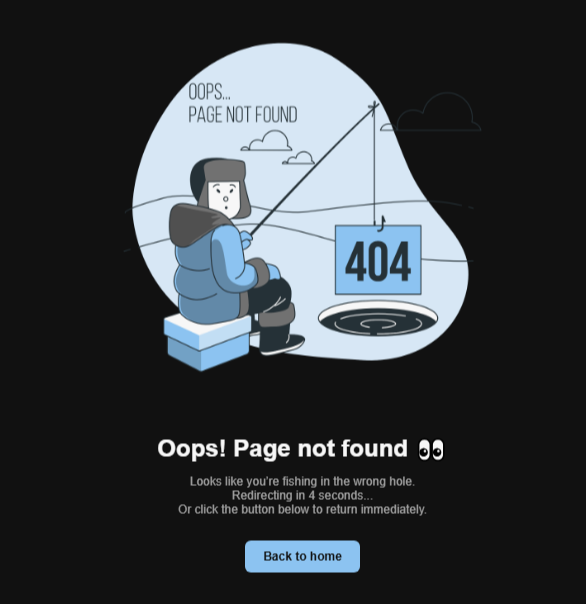

# 🚧 Custom 404 Error Page

A simple, responsive 404 error page with automatic redirection and a clean dark theme.  
Includes a countdown timer, a fallback "Back to Home" button, and accessibility best practices.

---

## ✨ Features

- 🎨 Dark themed responsive design
- 🖼️ Custom illustration for the 404 error
- 🔁 Automatic redirect to the homepage after 5 seconds
- ⏳ Countdown display (`Redirecting in 5 seconds...`)
- 🔗 "Back to Home" button for manual navigation
- ♿ Accessible: descriptive alt text, role attributes, and keyboard focus styles
- 📱 Mobile-friendly with flexible layout
- 🎬 Smooth fade-in animation on page load
- 🛡️ Graceful fallback if JavaScript is disabled (manual button remains)

---

## 📸 Preview

